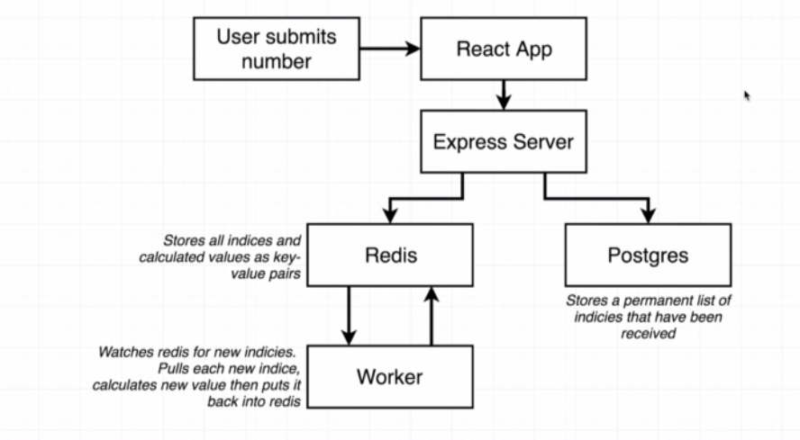
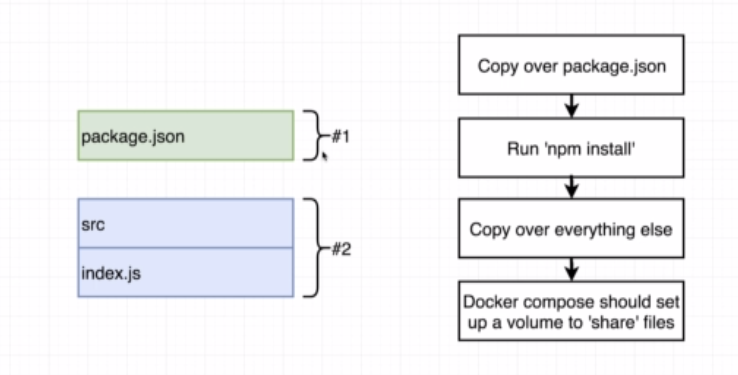
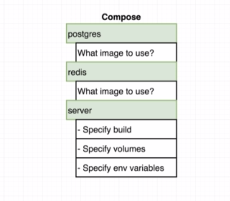
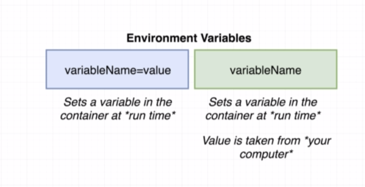
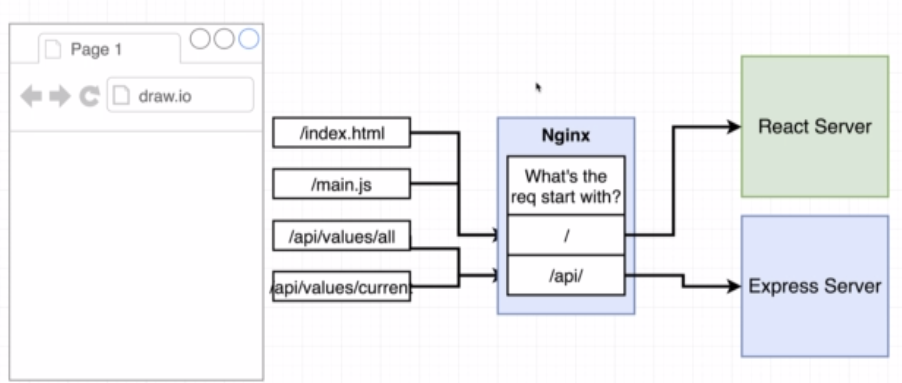

# This project demonstrate the use of docker to deploy multiple container application

## Architecture
 

 
 

## Flow of the Application

 
 

# Step 1
## Make DEV Dockerfiles of
    *   React App
    *   Express Server
    *   Worker environment

- We dont want to rebuilt the images upon changes while devlopment

 
 

# Step 2
## Docker  Compose 

 
 

# Step 3
## Envrionment Varibles

 
 

- NOTE
    - We do not have port mapping in docker-compose.yml
    - There are 2 Servers
        - Express
        - React

### The Nginx server will get all the req, and decide which backend service to route to.

