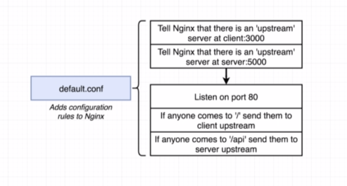
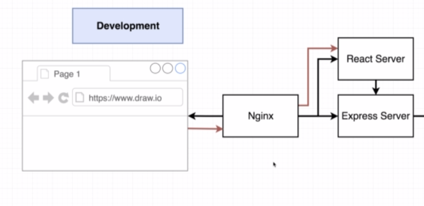

# This project demonstrate the use of docker to deploy multiple container application

## Architecture
 

<br>
<br>

## Flow of the Application


<br>
<br>

# Step 1
## Make DEV Dockerfiles of
    *   React App
    *   Express Server
    *   Worker environment

- We dont want to rebuilt the images upon changes while devlopment


<br>
<br>


# Step 2
## Docker  Compose 


<br>
<br>

# Step 3
## Envrionment Varibles


<br>
<br>

- NOTE
    - We do not have port mapping in docker-compose.yml
    - There are 2 Servers
        - Express
        - React

### The Nginx server will get all the req, and decide which backend service to route to.


<br>
<br>

# Step 4
## Configure NginX Server

<br>



<br>

- we will make a conter for nginx server
- Include and configure the nginx service in the docker-compose.yml
- ```sudo docker-compose up --build```
- The React app will be available att localhost:3050

<br>
<br>

# Step 5
## Open WebSockets

<br>



### To open Web Socket, add this in nginx default.config file

    location /sockjs-node {
        proxy_pass http://client;
        proxy_http_version 1.1;
        proxy_set_header Upgrade $http_upgrade;
        proxy_set_header Connection "Upgrade";
    }